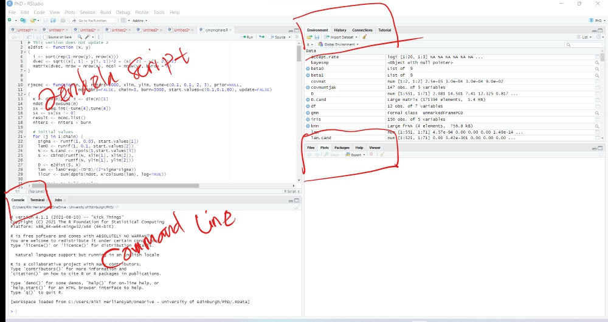
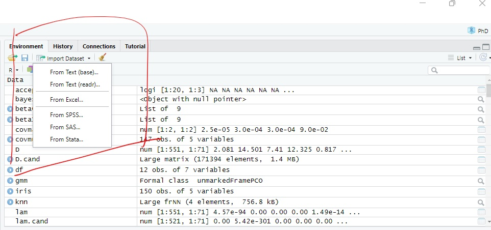

```{r load-packages, include = FALSE}
# Add any additional packages you need to this chunk
library(tidyverse)
library(knitr)
library(rmarkdown)
```

## Mengenal interface RStudi 

```{r castle, echo = FALSE, out.width = "100%", fig.align = "center", fig.cap = "Image credit: Riki Herliansyah."}


```


Tampilan RStudio terdiri dari beberapa jendela yaitu:

1.	Jendela Console/Command Line  yang terletak pada bagian sebelah kiri bawah yang disebut juga sebagai jendela Command. Pada jendela ini, kita dapat menuliskan perintah setelah tanda “->” dan R akan mengeksekusi perintah tersebut.
2.	Jendela Editor juga disebut jendela Script. Perintah yang kita tuliskan pada jendela Console pada dasarnya tidak dapat simpan, sehingga kita harus menuliskan kembali setiap kali kita membuka R. Jendela Script memungkinkan kita untuk menyimpan dan mengedit perintah yang kita tuliskan. 
3.	Jendela Environment/ History yang terletak pada bagian sebelah kanan atas. Pada jendela ini tersedia pilihan Import Dataset yang memberikan kita pilihan untuk mengimport data secara langsung dari berbagai jenis file diantara lain CSV, Excel, SPSS, SAS dan Stata. Jendela history menunjukkan pekerjaan yang telah kita ketikan sebelumnya.
4.	Jendela yang keempat adalah files/ plots/ packages/ help. Pada jendela ini kita dapat membuka file, melihat grafik, menginstal dan memuat package atau menggunakan fungsi help untuk mencari penjelasan mengenai syntax atau fungsi tertentu.


## Packages()

Packages adalah kumpulan-kumpulan dari fungsi R, kompilasi kode dan contoh data. Packages ini disimpan dalam sebuah wadah yang disebut "library". Perintah berikut ini adalah untuk melihat daftar packages yang telah terinstal secara otomatis di RStudio kita.

```{r, eval=TRUE}
library()
```

Packages dapat diinstal secara langsung dari sebuah resiptory atau dari sebuah file yang sebelumnya sudah didownload. Untuk menginstal packages, kita menggunakan perintah:

```{r, eval=FALSE}
install.packages("nama packages")
```

Untuk menggunakan packages yang sudah terinstal, kita dapat menggunakan perintah:
```{r, eval=FALSE}
library(namapackages)
```

Misal kita ingin menggunakan fungsi ggplot yang terdapat pada package ggplot2(), maka kita perlu memanggil library tersebut seperti contoh berikut:

```{r, echo = TRUE, fig.align="center"}

library(ggplot2)
mtcars %>%
  ggplot(mapping=aes(x=wt, y=mpg)) +
  geom_line()

  
```

## Files

Dalam menggunakan Rstudio, sebaiknya kita menggunakan directory yang berbeda untuk masing-masing project. Kita bisa mengatur direktori kerja R dengan menggunakan perintah:

```{r, eval=FALSE}
setwd("the_directory_path")
```

Disarankan juga untuk membuat project yang berbeda untuk setiap perkejaan yang kita lakukan sehingga mudah untuk berpindah dari satu project ke project yang lain.  


## Commands and Objects

Perintah di R selalu diakhiri dengan tanda kurung tutup, (). Dua perintah yang dituliskan dalam baris yang harus dipisah dengan menggunakan ";". Jika kita membuat sebuah objek dengan nilai tertentu maka kita harus menuliskan terlebih dahulu nama vobjek tersebut diikuti dengan tanda "<-" atau "=" baru kemudian nilai. Spasi tidak berpengaruh pada perintah, tetapi tidak boleh ada spasi dalam nama variabel. Penggunaan huruf kecil dan besar berpengaruh pada perintah di R. Untuk melihat objek yang kita buat, kita dapat menggunakan perintah "print()" atau cukup dengan menuliskan nama object tersebut.

```{r}
a <- 17; b = 10
a; print(b)

```
Adapun operasi matematika di R serupa dengan bahasa pemprograman pada umumnya seperti ditunjukkan pada contoh berikut.

```{r}
a = 17; b = 12
a + b
a - b
a * b
a / b
a^2
sqrt(b)
log(a)
exp(a-b)
```


## Mengenal Data Type in R
Pada umumnya, R memiliki 6 jenis tipe data yaitu:


|   Types   |  Example    |   
|-------|-------|
| Logical    | TRUE, FALSE  |    
| Integer   | 4L, 17L, 12L    |    
| Numeric  | 4.12, 17, 12    | 
| Character   | "good", 'TRUE'   | 
| Complex    | 12 + 17i    | 
| Raw    | "Hello" is stored as 48 65 6c 6c 6f   | 

```{r}
logcl = TRUE
brth = 17L
nmrc = 17
chr = "good"
com = 17i
class(logcl); class(brth); class(nmrc)
class(com); class(chr)
```


## Data Structures in R

Ada beberapa struktur data di R diantaranya adalah vektor, list, matriks, arrays dan data frames. Vektor adalah struktur data paling sederhana di R. Indeks vektor di R menggunakan simbol "[i]" dimana i adalah elemen ke- dari vektor. Untuk membuat vektor kita dapat menggunakan perintah c() atau beberapa perintah lain seperti seq().

```{r}
x = 1:10; x
z = seq(1,10,1); z
y <- c(1,2,3,4,5); y
y2 <- 2*y + 3
length(y2)

```
Struktur data berikutnya adalah matriks yang merupakan gabungan dari vektor. Indeks matriks di R menggunakan simbol "[i,j]" dimana i menujukkan baris dan j menujukkan kolom. Untuk membuat matriks kita dapat menggunakan perintah matrix().

```{r}
A = matrix(1:12, ncol = 3)
A
B = matrix(1:12, nrow = 4, byrow = TRUE)
B
is.matrix(A)
```

Kemudian terdapat pula jenis struktur data "list()" yang merupakan kumpulan berbagai struktur data. Tipe data yang terdapat pada list tidak harus sama seperti matriks atau vektor. 

```{r}
A = matrix(1:6, ncol = 3)
x = list(matriks=A, text="good", bool=TRUE, vektor= c(1,2,3,4))
x
```
Tipe selanjutnya adalah arrays. Array merupakan kumpulan matriks sehingga array biasanya memiliki 3 dimensi yaitu baris, kolom dan matriks ke-.

```{r}
array(1:12, dim=c(2,3,2))
```
Yang terakhir adalah data frames. Data frames memiliki struktur yang mirip dengan matriks hanya saja tipe data pada setiap kolom tidak harus sama seperti matriks. 

```{r}
A = c(1,4,5,10,2)
B = c("M","F","M","M","F")
C = c(17L, 12L, 92L, 10L, 10L)
H = data.frame(A=A, B=B, C=C)
H

```

## Indexing in R

Indeks sangat penting untuk diketahui karena kadang bisa sedikit menghambat dalam menyusun fungsi jika kita tidak familiar dengan indexing rule. R menggunakan "[]" sebagai indeksnya. Misalnya vektor, karena hanya satu dimensi maka indeks vektor adalah "[i]" dimana i menujukkan elemen vektor. 

```{r}
x = 1:10
x[1]; x[-1]; x[1:2]; x[c(1,3)]
x[x < 5]
```
Sedangkan untuk matriks menggunakan "[i,j]" dimana i menujukkan elemen baris dan j elemen kolom.
```{r}
A = matrix(1:12, ncol = 3)
A[1,]; A[,2]
A[1,1]

```

List menggunakan rule indeks yang sedikit berbeda. List menggunakan indeks "[[i]]" atau "$" untuk memanggil elemennya.
```{r}
A = matrix(1:6, ncol = 3)
x = list(matriks=A, text="good", bool=TRUE, vektor= c(1,2,3,4))
x[[2]]; x$text
```
Adapun array menggunakan indeks yang mirip dengan matriks akan tetapi terdapat satu dimensi tambahan yaitu "[n,i,j]" dimana n menujukkan matriks ke-.

```{r}
ar = array(1:12, dim=c(2,3,2))
ar[1,,]
ar[1,2,]
ar[2,1,1]
```
Yang terakhir adalah indeks pada data frames. Data frames menggunakan indeks yang serupa dengan matriks dan list yaitu "[i,j]" atau "$".

```{r}
A = c(1,4,5,10,2)
B = c("M","F","M","M","F")
C = c(17L, 12L, 92L, 10L, 10L)
H = data.frame(A=A, B=B, C=C)
H$A
H[,1]
H[1,2]
```


## Logical Operation and Loops
R memberikan opsi kepada pengunanya untuk menulis sendiri fungsi tertentu. Dalam pembuatan fungsi, kita sering menggunakan penyataan logical operation seperti if dan perulangan seperti for, while ke dalam fungsi kita. Perintah if digunakan ketika kita ingin meletakkan sebuah kondisi pada perintah tertentu. 

```{r}
fruits <- "apple"
if(fruits == "apple"){
  "i want it"
} else {
  "give me something else"
}

ifelse(fruits != "apple", "i want it", "give me something else")
```
Berikut adalah beberapa operator yang digunakan dalam logika.


```{r}
a = 17; b <- 10
a < b; a >= b
a != b
(b-3 == a) & (a > b)
(b == a) | (b < a)
```

Untuk membuat perulangan (loops), kita dapat menggunakan for() atau while(). Berikut adalah contoh bagaimana for() dan while() digunakan.

```{r}
x = 1:10
n = length(x)
s = numeric()
for (i in 1:n) {
  s[i] = 10 - 0.2*x[i]
}
s
i = 0
while(i <= n){
  s[i] = 10 - 0.2*x[i]
  i = i + 1
}
s
```


## Input Data di R

Pada sesi sebelumnya kita sudah membahas beberapa strutktur data di R. Secara tidak langsung kita sudah belajar bagaimana menginput data di R. Untuk lebih detail, kita akan ringkas beberapa cara menginput data di R. 

|Perintah | Pengertian|
|---|---|
| c()| membuat vektor|
| matrix()| membuat matriks|
| data.frame| membuat struktur data frame|
|list()| membuat struktur list|

Pertama, kita akan menginput vektor di R. Misalkan kita ingin menginput hasil UAS matematika dengan nilai sebagai berikut 80,55, 65, 78, 54, dan 90. Berikut perintah yang dapat digunakan untuk menginput data tersebut di R:

```{r}

nilai <- c(80, 55, 65, 78, 54, 90)
nilai

```


Selanjutnya akan ditunjukkan bagaimana menginput sebuah data dengan jenis matriks.

```{r}
matriks_nilai <- matrix(nilai, nrow = 2)
matriks_nilai

matriks_nilai <- matrix(nilai, nrow = 2, byrow = TRUE)
matriks_nilai

```
Jenis data berikutnya adalah data frames. Data frames merupakan sebuah matriks dimana kita dapat menuliskan nama variabel untuk setiap kolom data yang diinput. Misalkan kita memiliki sebuah data sebagai berikut:

|   A   |   B   |   C     |
|-------|-------|---------|
| 70    | 74    | 88      |
| 85    | 69    | 76.5    |
| 86.5  | 89    | 82      |
| 58    | 78    | 90      |
| 98    | 95    | 94      |
| 64    | 90    | 81      |

```{r }
nilai_data_frame <- data.frame(A = c(70, 85, 86.5, 58, 98, 64),
                               B = c(74, 69, 89, 78, 95, 90),
                               C = c(88, 76.5, 82, 90, 94, 81))
nilai_data_frame
```

Bagaimana jika data kita merupakan gabungan data non-numerik dan numerik seperti berikut:

|   A   |   B   |   C     | Gender |
|-------|-------|---------|--------|
| 70    | 74    | 88      |  F     |
| 85    | 69    | 76.5    |  M     |
| 86.5  | 89    | 82      |  F     |
| 58    | 78    | 90      |  F     |
| 98    | 95    | 94      |  M     |
| 64    | 90    | 81      |  M     |


```{r}
nilai_data_frame <- data.frame(A = c(70, 85, 86.5, 58, 98, 64),
                               B = c(74, 69, 89, 78, 95, 90),
                               C = c(88, 76.5, 82, 90, 94, 81),
                               Gender = factor(c("F", "M", "F", "F", "M", "M")))
nilai_data_frame
```

Tidak seperti aplikasi statistika lain pada umumnya, kita tidak dapat menyalin sebuah data secara langsung ke R dengan menggunakan perintah copy dan paste. Namun, RStudio memberikan kemudahan kepada para penggunanya dengan menyediakan fitur “import data” dari berbagai format.


```{r, echo = FALSE, out.width = "100%", fig.align = "center", fig.cap = "Image credit: Riki Herliansyah."}


```

Cara lain untuk memudahkan proses penginputan data adalah dengan mengatur direktori kerja di R menggunakan perintah 

```{r, eval=FALSE}
setwd("C:/Users/rikih/Documents/Tutorial")
```

Semua file yang tersimpan dalam folder Tutorial akan terbaca secara otomatis oleh R. Misalkan kita ingin memanggil data berformat .csv yang berasal dari folder tersebut maka kita cukup menggunakan perintah seperti di bawah tanpa harus memanggil direktori di mana file tersebut berada.

```{r, eval=FALSE}
read.csv("nama.csv")
readxl::read_xls("nama.csv")
```

## Manipulasi Data

Kita sebenarnya bisa memanipulasi data yang kita import seperti menambahkan kolom baru. Kita akan kembali ke tabel terakhir dan akan membuat kolom baru yaitu total yang merupakan nilai A + B + C dan kolom rata-rata yang merupakan total/3.

```{r}
nilai_data_frame <- nilai_data_frame %>%
  mutate(total = A+B+C,
         rata_rata = total/3) %>%
  arrange()
nilai_data_frame
```

Kita juga dapat menyaring data (filter) untuk menampilkan kategori tertentu. Misal kita ingin melihat deskripsi nilai untuk jenis kelamin laki-laki.

```{r}
nilai_data_frame %>%
  group_by(Gender) %>%
  summarize(mean_gender = mean(rata_rata), 
              .groups = "drop") %>%
  arrange(desc(mean_gender))

nilai_data_frame %>%
  filter(Gender == "F") %>%
  arrange()
  
```
Selanjutnya, kita akan mengubah data kita dengan menggabungkan kolom A, B dan C menjadi seperti berikut:

```{r}
nilai_data_frame %>%
  pivot_longer(cols = c(1:3),
               names_to = "Kelas",
               values_to = "Nilai") %>%
  arrange()

```
Berikut perintah yang dapat kita gunakan jika ingin memperoleh nilai statistik (rata-rata, median, kuartil).

```{r}
nilai_data_frame %>%
  pivot_longer(cols = c(1:3),
               names_to = "Kelas",
               values_to = "Nilai") %>%
  group_by(Kelas) %>%
  summarise(
    min  = min(Nilai, na.rm = TRUE),
    mean = mean(Nilai, na.rm = TRUE),
    med  = median(Nilai, na.rm = TRUE),
    sd   = sd(Nilai, na.rm = TRUE),
    iqr  = IQR(Nilai, na.rm = TRUE),
    max  = max(Nilai, na.rm = TRUE)
  ) %>%
  arrange()

```


## Grafik

Saya akan memberikan sedikit pengantar tentang cara membuat grafik di R menggunakan package ggplot2(). Kita akan menggunakan data terakhir yang sudah kita gabungkan.

```{r}
library(ggplot2)

nilai_data_frame %>%
  pivot_longer(cols = c(1:3),
               names_to = "Kelas",
               values_to = "Nilai") %>%
  ggplot(aes(x=Nilai, fill=Kelas)) +
  geom_density(alpha=0.2)

nilai_data_frame %>%
  pivot_longer(cols = c(1:3),
               names_to = "Kelas",
               values_to = "Nilai") %>%
  ggplot(aes(x=Nilai, fill=Kelas)) +
  geom_density(alpha=0.2) +
  facet_wrap(~Kelas, ncol=3) +
  guides(fill="none")

nilai_data_frame %>%
  pivot_longer(cols = c(1:3),
               names_to = "Kelas",
               values_to = "Nilai") %>%
  ggplot(aes(x=Nilai, fill=Kelas)) +
  geom_density(alpha=0.2) +
  facet_wrap(~Gender) +
  guides(fill="none")


```

Dan kita hanya perlu memilih visualisasi mana yang paling cocok untuk menceritakan data kita. Beberapa opsi yang digunakan data seperti ini adalah:

```{r}
nilai_data_frame %>%
  pivot_longer(cols = c(1:3),
               names_to = "Kelas",
               values_to = "Nilai") %>%
  ggplot(aes(x=Nilai, fill=Gender)) +
  geom_histogram(alpha=0.5, binwidth=8) +
  facet_wrap(~Gender) +
  guides(fill="none")

nilai_data_frame %>%
  pivot_longer(cols = c(1:3),
               names_to = "Kelas",
               values_to = "Nilai") %>%
  ggplot(aes(x=Gender, y=Nilai, color=Gender)) +
  geom_boxplot(alpha=0.5, binwidth=8) +
  guides(fill="none")

nilai_data_frame %>%
  pivot_longer(cols = c(1:3),
               names_to = "Kelas",
               values_to = "Nilai") %>%
  ggplot(aes(x=Gender, y=Nilai, color=Gender)) +
  geom_violin(alpha=0.5, binwidth=8) +
  guides(fill="none")
```


