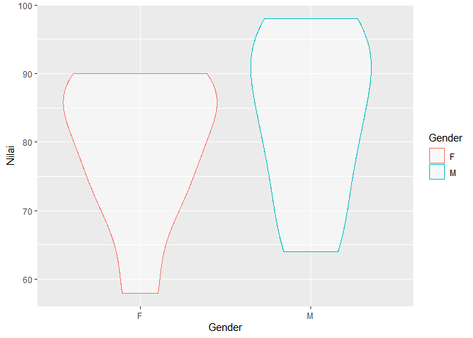

Introduction to R
================
Riki Herliansyah,
21/11/2021

## Mengenal interface R

<div class="figure" style="text-align: center">


<p class="caption">
Image credit: Riki Herliansyah.
</p>

</div>

## Interface RStudio

Tampilan RStudio terdiri dari beberapa jendela yaitu:

1.  Jendela Console/Command Line yang terletak pada bagian sebelah kiri
    bawah yang disebut juga sebagai jendela Command. Pada jendela ini,
    kita dapat menuliskan perintah setelah tanda “-&gt;” dan R akan
    mengeksekusi perintah tersebut.
2.  Jendela Editor juga disebut jendela Script. Perintah yang kita
    tuliskan pada jendela Console pada dasarnya tidak dapat simpan,
    sehingga kita harus menuliskan kembali setiap kali kita membuka R.
    Jendela Script memungkinkan kita untuk menyimpan dan mengedit
    perintah yang kita tuliskan.
3.  Jendela Environment/ History yang terletak pada bagian sebelah kanan
    atas. Pada jendela ini tersedia pilihan Import Dataset yang
    memberikan kita pilihan untuk mengimport data secara langsung dari
    berbagai jenis file diantara lain CSV, Excel, SPSS, SAS dan Stata.
    Jendela history menunjukkan pekerjaan yang telah kita ketikan
    sebelumnya.
4.  Jendela yang keempat adalah files/ plots/ packages/ help. Pada
    jendela ini kita dapat membuka file, melihat grafik, menginstal dan
    memuat package atau menggunakan fungsi help untuk mencari penjelasan
    mengenai syntax atau fungsi tertentu.

## packages()

Packages adalah kumpulan-kumpulan dari fungsi R, kompilasi kode dan
contoh data. Packages ini disimpan dalam sebuah wadah yang disebut
“library”. Perintah berikut ini adalah untuk melihat daftar packages
yang telah terinstal secara otomatis di RStudio kita.

``` r
library()
```

Misal kita ingin menggunakan fungsi ggplot yang terdapat pada package
ggplot2(), maka kita perlu memanggil library tersebut seperti contoh
berikut:

``` r
library(ggplot2)
mtcars %>%
  ggplot(mapping=aes(x=wt, y=mpg)) +
  geom_line()
```


## Input Data di R

Pertama, kita akan menginput vektor di R. Misalkan kita ingin menginput
hasil UAS matematika dengan nilai sebagai berikut 80,55, 65, 78, 54, dan
90. Berikut perintah yang dapat digunakan untuk menginput data tersebut
di R:

``` r
nilai <- c(80, 55, 65, 78, 54, 90)
nilai
```

    ## [1] 80 55 65 78 54 90

Untuk memanggil elemen tertentu dari vektor, kita dapat menggunakan
perintah seperti berikut atau kita dapat mengeluarkan elemen tertentu
dengan menggunakan adalah -.

``` r
nilai[1]
```

    ## [1] 80

``` r
nilai[c(1,2)]
```

    ## [1] 80 55

``` r
nilai[-2]
```

    ## [1] 80 65 78 54 90

Selanjutnya akan ditunjukkan bagaimana menginput sebuah data dengan
jenis matriks.

``` r
matriks_nilai <- matrix(nilai, nrow = 2)
matriks_nilai
```

    ##      [,1] [,2] [,3]
    ## [1,]   80   65   54
    ## [2,]   55   78   90

``` r
matriks_nilai <- matrix(nilai, nrow = 2, byrow = TRUE)
matriks_nilai
```

    ##      [,1] [,2] [,3]
    ## [1,]   80   55   65
    ## [2,]   78   54   90

Jenis data berikutnya adalah data frames. Data frames merupakan sebuah
matriks dimana kita dapat menuliskan nama variabel untuk setiap kolom
data yang diinput. Misalkan kita memiliki sebuah data sebagai berikut:

| A    | B   | C    |
|------|-----|------|
| 70   | 74  | 88   |
| 85   | 69  | 76.5 |
| 86.5 | 89  | 82   |
| 58   | 78  | 90   |
| 98   | 95  | 94   |
| 64   | 90  | 81   |

``` r
nilai_data_frame <- data.frame(A = c(70, 85, 86.5, 58, 98, 64),
                               B = c(74, 69, 89, 78, 95, 90),
                               C = c(88, 76.5, 82, 90, 94, 81))
nilai_data_frame
```

    ##      A  B    C
    ## 1 70.0 74 88.0
    ## 2 85.0 69 76.5
    ## 3 86.5 89 82.0
    ## 4 58.0 78 90.0
    ## 5 98.0 95 94.0
    ## 6 64.0 90 81.0

Bagaimana jika data kita merupakan gabungan data non-numerik dan numerik
seperti berikut:

| A    | B   | C    | Gender |
|------|-----|------|--------|
| 70   | 74  | 88   | F      |
| 85   | 69  | 76.5 | M      |
| 86.5 | 89  | 82   | F      |
| 58   | 78  | 90   | F      |
| 98   | 95  | 94   | M      |
| 64   | 90  | 81   | M      |

``` r
nilai_data_frame <- data.frame(A = c(70, 85, 86.5, 58, 98, 64),
                               B = c(74, 69, 89, 78, 95, 90),
                               C = c(88, 76.5, 82, 90, 94, 81),
                               Gender = factor(c("F", "M", "F", "F", "M", "M")))
nilai_data_frame
```

    ##      A  B    C Gender
    ## 1 70.0 74 88.0      F
    ## 2 85.0 69 76.5      M
    ## 3 86.5 89 82.0      F
    ## 4 58.0 78 90.0      F
    ## 5 98.0 95 94.0      M
    ## 6 64.0 90 81.0      M

Tidak seperti aplikasi statistika lain pada umumnya, kita tidak dapat
menyalin sebuah data secara langsung ke R dengan menggunakan perintah
copy dan paste. Namun, RStudio memberikan kemudahan kepada para
penggunanya dengan menyediakan fitur “import data” dari berbagai format.

<div class="figure" style="text-align: center">


<p class="caption">
Image credit: Riki Herliansyah.
</p>

</div>

Cara lain untuk memudahkan proses penginputan data adalah dengan
mengatur direktori kerja di R menggunakan perintah

``` r
setwd("C:/Users/rikih/Documents/R")
```

Semua file yang tersimpan dalam folder R akan terbaca secara otomatis
oleh R. Misalkan kita ingin memanggil data berformat .csv yang berasal
dari folder tersebut maka kita cukup menggunakan perintah seperti di
bawah tanpa harus memanggil direktori di mana file tersebut berada.

``` r
read.csv("nama.csv")
readxl::read_xls("nama.csv")
```

## Manipulasi Data

Kita sebenarnya bisa memanipulasi data yang kita import seperti
menambahkan kolom baru. Kita akan kembali ke tabel terakhir dan akan
membuat kolom baru yaitu total yang merupakan nilai A + B + C dan kolom
rata-rata yang merupakan total/3.

``` r
nilai_data_frame <- nilai_data_frame %>%
  mutate(total = A+B+C,
         rata_rata = total/3) %>%
  arrange()
nilai_data_frame
```

    ##      A  B    C Gender total rata_rata
    ## 1 70.0 74 88.0      F 232.0  77.33333
    ## 2 85.0 69 76.5      M 230.5  76.83333
    ## 3 86.5 89 82.0      F 257.5  85.83333
    ## 4 58.0 78 90.0      F 226.0  75.33333
    ## 5 98.0 95 94.0      M 287.0  95.66667
    ## 6 64.0 90 81.0      M 235.0  78.33333

Kita juga dapat menyaring data (filter) untuk menampilkan kategori
tertentu. Misal kita ingin melihat deskripsi nilai untuk jenis kelamin
laki-laki.

``` r
nilai_data_frame %>%
  group_by(Gender) %>%
  summarize(mean_gender = mean(rata_rata), 
              .groups = "drop") %>%
  arrange(desc(mean_gender))
```

    ## # A tibble: 2 x 2
    ##   Gender mean_gender
    ##   <fct>        <dbl>
    ## 1 M             83.6
    ## 2 F             79.5

``` r
nilai_data_frame %>%
  filter(Gender == "F") %>%
  arrange()
```

    ##      A  B  C Gender total rata_rata
    ## 1 70.0 74 88      F 232.0  77.33333
    ## 2 86.5 89 82      F 257.5  85.83333
    ## 3 58.0 78 90      F 226.0  75.33333

Selanjutnya, kita akan mengubah data kita dengan menggabungkan kolom A,
B dan C menjadi seperti berikut:

``` r
nilai_data_frame %>%
  pivot_longer(cols = c(1:3),
               names_to = "Kelas",
               values_to = "Nilai") %>%
  arrange()
```

    ## # A tibble: 18 x 5
    ##    Gender total rata_rata Kelas Nilai
    ##    <fct>  <dbl>     <dbl> <chr> <dbl>
    ##  1 F       232       77.3 A      70  
    ##  2 F       232       77.3 B      74  
    ##  3 F       232       77.3 C      88  
    ##  4 M       230.      76.8 A      85  
    ##  5 M       230.      76.8 B      69  
    ##  6 M       230.      76.8 C      76.5
    ##  7 F       258.      85.8 A      86.5
    ##  8 F       258.      85.8 B      89  
    ##  9 F       258.      85.8 C      82  
    ## 10 F       226       75.3 A      58  
    ## 11 F       226       75.3 B      78  
    ## 12 F       226       75.3 C      90  
    ## 13 M       287       95.7 A      98  
    ## 14 M       287       95.7 B      95  
    ## 15 M       287       95.7 C      94  
    ## 16 M       235       78.3 A      64  
    ## 17 M       235       78.3 B      90  
    ## 18 M       235       78.3 C      81

Berikut perintah yang dapat kita gunakan jika ingin memperoleh nilai
statistik (rata-rata, median, kuartil).

``` r
nilai_data_frame %>%
  pivot_longer(cols = c(1:3),
               names_to = "Kelas",
               values_to = "Nilai") %>%
  group_by(Kelas) %>%
  summarise(
    min  = min(Nilai, na.rm = TRUE),
    mean = mean(Nilai, na.rm = TRUE),
    med  = median(Nilai, na.rm = TRUE),
    sd   = sd(Nilai, na.rm = TRUE),
    iqr  = IQR(Nilai, na.rm = TRUE),
    max  = max(Nilai, na.rm = TRUE)
  ) %>%
  arrange()
```

    ## # A tibble: 3 x 7
    ##   Kelas   min  mean   med    sd   iqr   max
    ##   <chr> <dbl> <dbl> <dbl> <dbl> <dbl> <dbl>
    ## 1 A      58    76.9  77.5 15.3  20.6     98
    ## 2 B      69    82.5  83.5 10.3  14.8     95
    ## 3 C      76.5  85.2  85    6.51  8.25    94

## Grafik

Saya akan memberikan sedikit pengantar tentang cara membuat grafik di R
menggunakan package ggplot2(). Kita akan menggunakan data terakhir yang
sudah kita gabungkan.

``` r
library(ggplot2)

nilai_data_frame %>%
  pivot_longer(cols = c(1:3),
               names_to = "Kelas",
               values_to = "Nilai") %>%
  ggplot(aes(x=Nilai, fill=Kelas)) +
  geom_density(alpha=0.2)
```

<!-- -->

``` r
nilai_data_frame %>%
  pivot_longer(cols = c(1:3),
               names_to = "Kelas",
               values_to = "Nilai") %>%
  ggplot(aes(x=Nilai, fill=Kelas)) +
  geom_density(alpha=0.2) +
  facet_wrap(~Kelas, ncol=3) +
  guides(fill="none")
```

<!-- -->

``` r
nilai_data_frame %>%
  pivot_longer(cols = c(1:3),
               names_to = "Kelas",
               values_to = "Nilai") %>%
  ggplot(aes(x=Nilai, fill=Kelas)) +
  geom_density(alpha=0.2) +
  facet_wrap(~Gender) +
  guides(fill="none")
```

<!-- -->

Dan kita hanya perlu memilih visualisasi mana yang paling cocok untuk
menceritakan data kita. Beberapa opsi yang digunakan data seperti ini
adalah:

``` r
nilai_data_frame %>%
  pivot_longer(cols = c(1:3),
               names_to = "Kelas",
               values_to = "Nilai") %>%
  ggplot(aes(x=Nilai, fill=Gender)) +
  geom_histogram(alpha=0.5, binwidth=8) +
  facet_wrap(~Gender) +
  guides(fill="none")
```

<!-- -->

``` r
nilai_data_frame %>%
  pivot_longer(cols = c(1:3),
               names_to = "Kelas",
               values_to = "Nilai") %>%
  ggplot(aes(x=Gender, y=Nilai, color=Gender)) +
  geom_boxplot(alpha=0.5, binwidth=8) +
  guides(fill="none")
```

    ## Warning: Ignoring unknown parameters: binwidth

<!-- -->

``` r
nilai_data_frame %>%
  pivot_longer(cols = c(1:3),
               names_to = "Kelas",
               values_to = "Nilai") %>%
  ggplot(aes(x=Gender, y=Nilai, color=Gender)) +
  geom_violin(alpha=0.5, binwidth=8) +
  guides(fill="none")
```

    ## Warning: Ignoring unknown parameters: binwidth

<!-- -->

<style type="text/css">
h1, h4 {
  text-align: center;
  color: blue;
  font-weight: bold;
}

body{
  font-family: Helvetica;
  font-size: 16pt;
}

</style>
